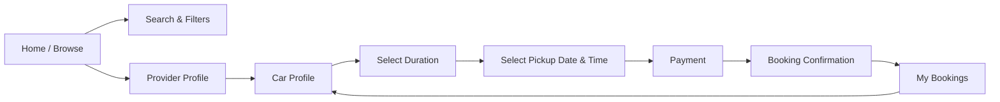
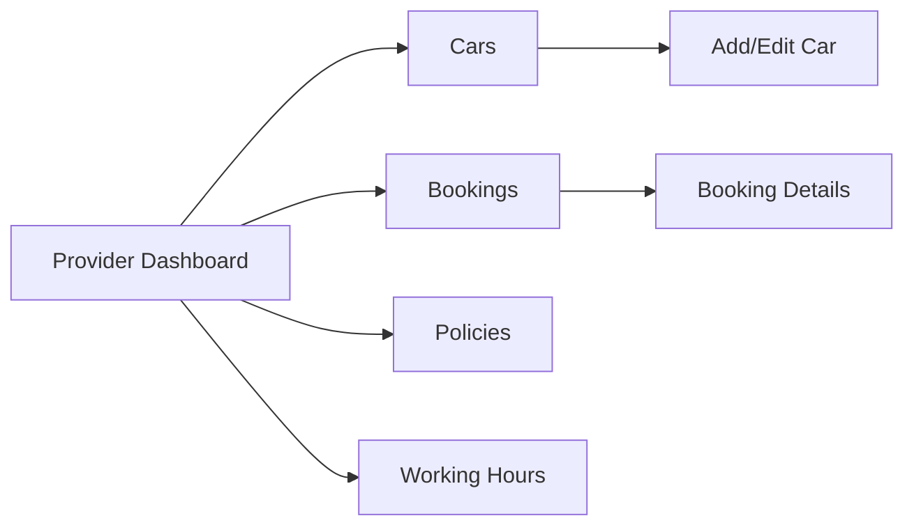
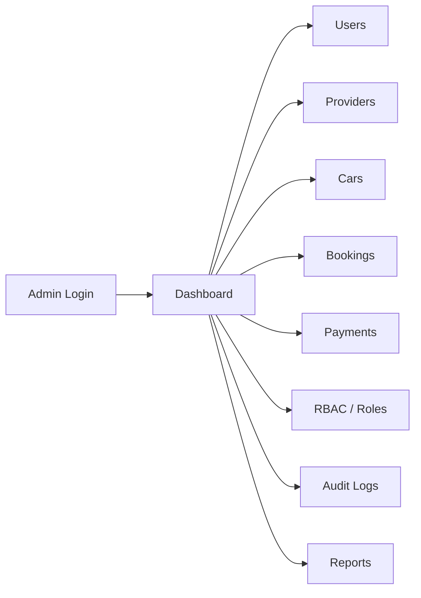
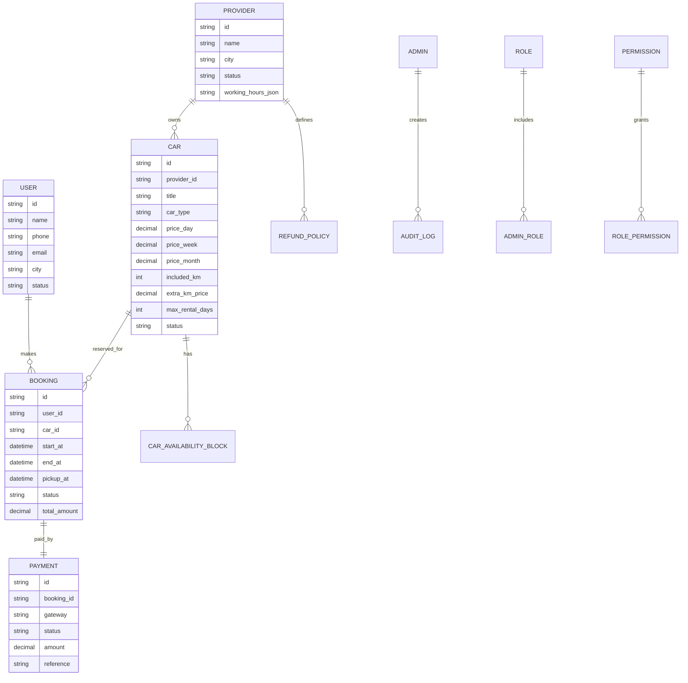
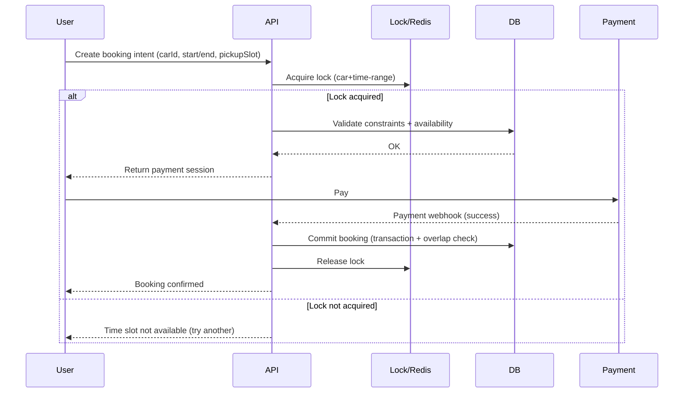

# Car Booking Platform Proposal (User / Provider / Admin)
# مقترح منصة حجز السيارات (مستخدم / مزوّد / لوحة تحكم)

_Last updated: 2025-12-16_

---

## Table of Contents
- [English](#english)
- [العربية](#العربية)
- [Assets / Wireframe Reference](#assets--wireframe-reference)

---

# English

## 1) Overview
This proposal describes a **Car Booking Platform** consisting of 3 applications:

1. **User App (Flutter)**: customers browse providers and cars, book, and pay.
2. **Provider App (Flutter)**: car providers manage cars, prices, policies, availability, and bookings.
3. **Admin Panel (Web)**: admins manage the platform with **roles & permissions (RBAC)**, moderation, and reporting.

Backend services run on **AWS** and guarantee that a car **cannot be double-booked** using a **reservation/locking + queueing approach**.

---

## 2) Core Concepts
### Providers & Cars
- A **provider** publishes one or more **cars** with:
  - Photos, specs, features
  - Pricing: **per day / week / month**
  - Included mileage (max kilometers per rental period) + **extra km price**
  - Booking constraints: max/min duration (days/weeks/months) per provider and per car
  - Working hours (pickup appointment windows)
  - Refund/Cancellation policy (e.g., free cancellation before 24h)

### Booking Rules
- No direct chat/connection between user and provider in the app.
- Once a booking is confirmed (paid or authorized), the car is blocked for the selected time window.
- The system must protect against simultaneous booking attempts for the same car/time range.

---

## 3) Target Users (Personas)
- **User (Customer)**: searches, filters, compares, books, pays, and receives confirmations.
- **Provider (Car Owner / Company)**: manages inventory, pricing, policies, and schedules.
- **Admin**: manages onboarding, compliance, disputes, refunds, and reports.

---

## 4) Feature Scope (MVP)

### 4.1 User App (Flutter)
**Browse & Discovery**
- Home feed: providers / cars
- Search
- Filters (examples):
  - City, area / pickup location
  - Car type (Sedan, SUV, Hatchback, Van, Luxury)
  - Transmission (Auto/Manual)
  - Fuel (Gas, Diesel, Hybrid, EV)
  - Price range
  - Seats, doors
  - Rating, provider verified
  - Mileage policy (unlimited / limited)

**Car Profile**
- Photos gallery
- Price per day/week/month
- Included mileage + extra km price
- Provider info (public)
- Cancellation/refund policy summary
- Availability calendar (read-only)
- “Book now” CTA

**Booking**
- Select duration (days/weeks/months) within constraints
- Select pickup date/time within provider working hours
- Pricing breakdown (base price, add-ons, deposit, taxes/fees if any)
- Payment (gateway integration)
- Booking status: Pending / Confirmed / Cancelled / Completed
- Booking history

**Notifications**
- Push + email/SMS (optional): booking confirmations, reminders, cancellation updates

---

### 4.2 Provider App (Flutter)
**Provider Onboarding**
- Profile, business info
- Verification (optional in MVP but recommended)
- Working hours & holidays
- Payment payout setup

**Car Management**
- Create/edit car: photos, specs, pricing tiers, mileage policy, constraints
- Availability management:
  - Blackout dates
  - Maintenance blocks
  - Default max rental duration and per-car overrides

**Bookings**
- List bookings (timeline + list)
- View booking details (pickup slot, duration, payment status)
- Approve/decline (optional; depends on business model)
- Mark “car handed over” / “returned”
- Incident notes (optional)

**Policies**
- Cancellation / refund rules (templates + per-car override)

---

### 4.3 Admin Panel (Web: Node.js + React)
**RBAC**
- Create admins
- Roles & permissions (fine-grained)
- Audit logs (who changed what)

**Platform Operations**
- Manage users & providers
- Suspend/block accounts
- Car moderation (approve/reject car listings)
- Manage disputes & refunds
- Manage coupons/promotions (optional)

**Reports & Analytics**
- Bookings volume, revenue, refunds
- Top providers, active users
- Occupancy/utilization per car
- Payment reconciliation

---

## 5) Wireframes (Low-Fidelity)

### 5.1 Navigation Map — User App


### 5.2 Navigation Map — Provider App


### 5.3 Navigation Map — Admin Panel


### 5.4 Example Screen — Car Profile (Sketch)
> This is a **generic wireframe**. A real HTML reference is included under Assets.

```
+----------------------------------------------------+
|  [Back]                   Car Profile              |
+----------------------------------------------------+
|  [ Image Gallery / Slider ]                        |
|  - - - - - - - - - - - - - - - - - - - -          |
|  Car Name / Model                                  |
|  Provider Name (Verified?)                         |
|                                                    |
|  Price:  day / week / month                        |
|  Included KM: X per period                          |
|  Extra KM:   Y per km                               |
|                                                    |
|  [Key Specs: seats, transmission, fuel, ...]       |
|                                                    |
|  Cancellation Policy: Free before 24h / etc.        |
|  Availability Calendar (read-only)                  |
|                                                    |
|  [Book Now]                                        |
+----------------------------------------------------+
```

---

## 6) Booking Concurrency & Queueing (No Double Booking)
To guarantee a car cannot be booked twice for the same time slot:

### Option A (Recommended): **Distributed Lock + Transaction**
- Use **Redis (AWS ElastiCache)** for short-lived locks:
  - Lock key: `lock:car:{carId}:{startDate}:{endDate}`
  - TTL: small (e.g., 30–60 seconds) while user is paying
- Confirm booking using an **atomic DB constraint**:
  - Store bookings in a DB with an “overlap check”
  - Use transaction isolation / exclusion constraint (PostgreSQL) or equivalent
- If payment succeeds, finalize booking and release lock.

### Option B: **Queue Per Car (SQS FIFO)**
- Each car has a FIFO message group `carId`.
- Booking requests are processed sequentially per car.
- Great for high contention, but slightly more latency.

> MVP can start with Option A, then add Option B for scaling.

---

## 7) High-Level Architecture (AWS)
```mermaid
flowchart TB
  U[Flutter User App] --> APIG[API Gateway / Load Balancer]
  PR[Flutter Provider App] --> APIG
  WEB[React Admin (S3 + CloudFront)] --> APIG

  APIG --> AUTH[Auth (Cognito or Custom JWT)]
  APIG --> API[Node.js Backend (ECS/Lambda)]
  API --> DB[(PostgreSQL RDS)]
  API --> REDIS[(ElastiCache Redis)]
  API --> S3[(S3 - Car Images)]
  API --> MQ[SQS / EventBridge]
  API --> PAY[Payment Gateway]
  MQ --> NOTIF[Notifications (SNS/SES/FCM)]
  API --> LOGS[CloudWatch + Audit Logs]
```

**Suggested stack**
- Backend: Node.js (NestJS/Express) + TypeScript
- DB: PostgreSQL (RDS)
- Cache/Lock: Redis (ElastiCache)
- Files: S3 + CloudFront
- Auth: Cognito or custom JWT
- CI/CD: GitHub Actions → AWS (ECS/Lambda)
- Observability: CloudWatch, alarms, tracing (optional)

---

## 8) Data Model (Simplified ERD)


---

## 9) Booking Flow (Sequence)


---

## 10) Security, RBAC, and Audit
- **RBAC** for Admins:
  - Example permissions: `users.read`, `users.block`, `providers.verify`, `cars.moderate`, `bookings.refund`, `reports.view`, `rbac.manage`
- **Provider permissions** (simpler roles):
  - Owner, Staff (optional)
- **Audit Logs**:
  - Required for admin actions (block user, change refund, override booking)

---

## 11) Deliverables
- Flutter app(s) (User + Provider)
- Admin web (React) + Admin API (Node.js)
- Backend API + DB schema + Infrastructure configuration
- Documentation (this proposal + API docs + deployment notes)

---

# العربية

## 1) نظرة عامة
هذا المقترح يوضح **منصة لحجز السيارات** تتكوّن من 3 تطبيقات:

1. **تطبيق المستخدم (Flutter)**: تصفح المزوّدين والسيارات ثم الحجز والدفع.
2. **تطبيق المزوّد (Flutter)**: إدارة السيارات والأسعار والسياسات والتوافر والحجوزات.
3. **لوحة تحكم الإدارة (Web)**: إدارة المنصة كاملة مع **صلاحيات وأدوار (RBAC)** وتقارير ومتابعة المدفوعات.

الخدمات الخلفية تعمل على **AWS** مع ضمان أن السيارة **لا يمكن حجزها مرتين لنفس الفترة** عبر نظام **قفل/حجز + طابور (Queueing)**.

---

## 2) المفاهيم الأساسية
### المزوّد والسيارات
- **المزوّد** يعرض سيارة أو أكثر مع:
  - صور ومواصفات وميزات
  - تسعير: **يومي / أسبوعي / شهري**
  - حد كيلومترات شامل للفترة + **سعر الكيلومتر الزائد**
  - قيود الحجز: حد أقصى/أدنى للمدة (أيام/أسابيع/شهور) على مستوى المزوّد وعلى مستوى السيارة
  - ساعات عمل (مواعيد استلام السيارة)
  - سياسة الإلغاء والاسترجاع (مثلاً إلغاء مجاني قبل 24 ساعة)

### قواعد الحجز
- لا يوجد تواصل مباشر داخل التطبيق بين المستخدم والمزوّد.
- بعد تأكيد الحجز (دفع/تفويض دفع) يتم حجز السيارة ومنع أي حجز آخر لنفس الفترة.
- النظام يجب أن يمنع تعارض محاولات الحجز المتزامنة لنفس السيارة.

---

## 3) أنواع المستخدمين
- **المستخدم**: يبحث ويصفّي ويقارن ويحجز ويدفع ويتلقى التأكيد.
- **المزوّد**: يدير السيارات والتسعير والسياسات والجدولة.
- **الإدارة**: تدير التسجيلات، والتحقق، والنزاعات، والاسترجاعات، والتقارير.

---

## 4) نطاق الخصائص (النسخة الأولى MVP)

### 4.1 تطبيق المستخدم (Flutter)
**التصفح والبحث**
- الصفحة الرئيسية: مزوّدون/سيارات
- بحث
- فلاتر (أمثلة):
  - المدينة والمنطقة / مكان الاستلام
  - نوع السيارة (سيدان، SUV، ...)
  - ناقل الحركة (أوتوماتيك/مانيوال)
  - الوقود (بنزين/ديزل/هايبرد/كهرباء)
  - نطاق السعر
  - عدد المقاعد
  - التقييم / مزوّد موثّق
  - سياسة الكيلومترات (غير محدودة/محدودة)

**صفحة السيارة**
- صور
- سعر يوم/أسبوع/شهر
- حد الكيلومترات وسعر الزائد
- معلومات المزوّد (عامة)
- ملخص سياسة الإلغاء/الاسترجاع
- تقويم التوافر (قراءة فقط)
- زر “احجز الآن”

**الحجز والدفع**
- اختيار مدة الحجز داخل القيود
- اختيار موعد الاستلام داخل ساعات عمل المزوّد
- تفصيل السعر
- الدفع عبر بوابة دفع
- حالات الحجز: قيد المعالجة / مؤكد / ملغي / مكتمل
- سجل الحجوزات

---

### 4.2 تطبيق المزوّد (Flutter)
- بيانات المزوّد والتحقق (اختياري في MVP لكن يُفضل)
- ساعات العمل والإجازات
- إدارة السيارات (إضافة/تعديل/صور/تسعير/سياسة كيلومترات/قيود)
- إدارة التوافر (حظر تواريخ للصيانة، إلخ)
- إدارة الحجوزات (عرض التفاصيل وتغيير الحالة “تم التسليم/تم الاسترجاع”)
- إدارة سياسات الإلغاء/الاسترجاع

---

### 4.3 لوحة الإدارة (Node.js + React)
- إنشاء مديرين جدد + أدوار وصلاحيات (RBAC)
- سجل تغييرات (Audit Log)
- إدارة المستخدمين والمزوّدين والسيارات والحجوزات والمدفوعات
- إيقاف/حظر حسابات
- تقارير وإحصائيات (حجوزات/إيرادات/استرجاعات/أفضل مزوّدين)

---

## 5) وايرفريم (مخططات بسيطة)
> نفس مخططات التنقل المذكورة في قسم English يمكن استخدامها كما هي، لأنها توضّح تدفق الشاشات بشكل واضح.

---

## 6) منع الحجز المزدوج (قفل + طابور)
- **الخيار الأفضل**: قفل مؤقت في Redis أثناء الدفع + تأكيد نهائي داخل قاعدة البيانات بمعاملة (Transaction) تمنع تداخل الفترات.
- خيار إضافي للتوسّع: **SQS FIFO** لمعالجة طلبات الحجز بالتسلسل لكل سيارة.

---

## 7) المعمارية على AWS (نظرة عامة)
- Flutter (مستخدم/مزوّد) ↔ API ↔ Backend Node.js
- RDS PostgreSQL للبيانات
- Redis للأقفال والكاش
- S3 + CloudFront للصور
- SQS/EventBridge للمهام غير الفورية
- SNS/SES/FCM للإشعارات
- CloudWatch للمراقبة والسجلات

---

## 8) التسليمات
- تطبيق Flutter للمستخدم والمزوّد
- لوحة إدارة React + خدمات Admin/Backend Node.js
- قاعدة بيانات + بنية AWS
- توثيق شامل (هذا الملف + توثيق APIs + ملاحظات التشغيل)

---

# Assets / Wireframe Reference
- Example HTML (Car Profile reference): `assets/example_car_profile/index.html`
- Assets readme: `assets/README.md`
